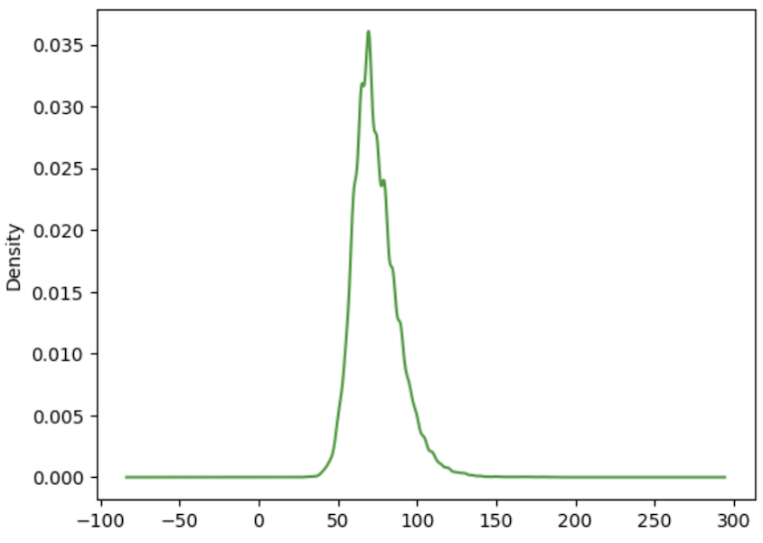

# CardioVascular Data Analysis - An Emipirical Analysis

## Introduction

This project aims to provide a detailed analysis of Patient Data and their relation to different stages of Hypertension. In this study, we have analyze the relation of a subject’s weight, systolic blood pressure and diastolic blood pressure to the Hypertension stage of the subject. In this project we have only used Hypertension Stage 1 and Hypertension stage 2 as target categories.

**Important**: To run the notebook you will have to get a API Token from Kaggle. Follow the instructions to run the notebook:

### Instructions

1. Create a new API Token.
2. Download the API Token and open the (downloaded) json file as text file.
3. Copy the key from the json file and replace the following line:

```json
{"username":"farhanarrafi","key":"get_a_key_from_kaggle_to_run_the_notebook"}
```

4. Run the notebook.


## Variables Used in this Analysis

1. Weight - The weight of the subject in kilogram.
2. Systolic Pressure - The maximum blood pressure during contraction of the ventricles.
3. Diastolic Pressure - The minimum blood pressure recorded just before the next contraction.

## Exploratory Data Analysis




## Analysis

### Regression line of Weight


### Regression using 2 variables Systolic and Diastolic Blood Pressure


### Regression using 3 variables Weight, Systolic and Diastolic Blood Pressure


## Results

Using only Systolic BP and Diastolic BP provides better predictions than using all three - Weight, Systolic BP and Diastolic BP.

For more details you can check the [final presentation](Final_Presentation).


## Dataset Source

For this project we have collected the data from the Kaggle dataset - “[Cardiovascular Disease by Aidan](https://www.kaggle.com/datasets/colewelkins/cardiovascular-disease)”.
As per the information provided, this data represents consolidated data from two sources:

1. UCI Machine Learning Repository - Heart Disease Dataset
2. Kaggle - Heart Disease Dataset by YasserH

In the original dataset there are about 68000 rows of data. However, to keep our analysis simple we have preserved the 2000 rows using random selection and discarded the rest of the data.

## Contribution

In this project other than me three other people also contributed. The worked with different combination of variables.

1. [Sushant Thapa](https://github.com/sushant-thapa) - You can check their work on other variables [here](https://github.com/sushant-thapa/statistical_analysis_on_hypertension_dataset).
2. [Harika Prathipati](https://github.com/Hsv0345) - You can check their work on other variables [here](https://github.com/Hsv0345/Predicting-Heart-Disease).
3. [Lokesh Mylavarpu](https://github.com/Lokesh-Mylavarpu)

## References

1. Patricia S. Abril and Robert Plant, 2007. The patent holder's dilemma: Buy, sell, or troll? Commun. ACM 50, 1 (Jan, 2007), 36-44. DOI: https://doi.org/10.1145/1188913.1188915.
2. Clinical Methods: The History, Physical, and Laboratory Examinations. 3rd edition, Walker HK, Hall WD, Hurst JW, editors. Boston: Butterworths; 1990, Chapter 16.
